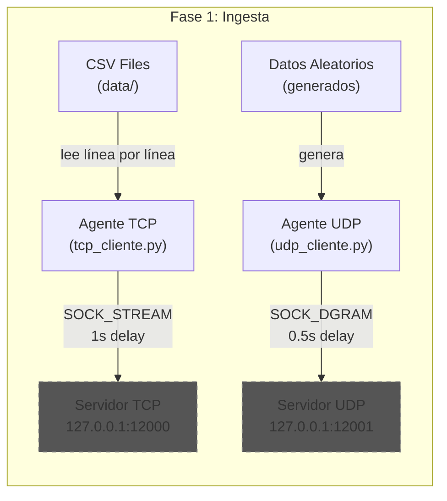

# Fase 1: Ingesta de Datos - Explicación paso a paso

## Resumen del proyecto completo

El proyecto simula un **Data Warehouse moderno** en 3 fases:

| Fase | Nombre | Qué hace |
|------|--------|----------|
| **1** | Ingesta de datos | Leer CSVs y enviarlos por la red (TCP y UDP) |
| **2** | Recepción y almacenamiento | Servidor concurrente que recibe datos y los guarda en PostgreSQL (Supabase) |
| **3** | Exposición y visualización | API (Flask/FastAPI) + Frontend (React + Chart.js) |

---

## Fase 1: Lo que necesitas hacer

La Fase 1 tiene **2 pasos**: descargar el dataset y crear los agentes clientes.

---

### Paso 1: Dataset - Estado actual

> [!TIP]
> **Tus datos ya están correctos. No necesitas descargar nada nuevo.**

El documento pide el dataset de Kaggle: [Brazilian E-Commerce (Olist)](https://www.kaggle.com/datasets/olistbr/brazilian-ecommerce)

Tu carpeta `data/` ya contiene los **9 archivos correctos**:

| Archivo | Contenido | Relevancia |
|---------|-----------|------------|
| `olist_orders_dataset.csv` | IDs, estados y fechas de órdenes | **Principal** - tabla de hechos |
| `olist_order_items_dataset.csv` | Precios y costos de envío por item | **Principal** - detalle financiero |
| `olist_products_dataset.csv` | Categorías y características | **Principal** - dimensión producto |
| `olist_customers_dataset.csv` | Info de clientes y ubicación | Soporte |
| `olist_geolocation_dataset.csv` | Coordenadas geográficas | Soporte |
| `olist_order_payments_dataset.csv` | Métodos y montos de pago | Soporte |
| `olist_order_reviews_dataset.csv` | Reseñas y calificaciones | Soporte |
| `olist_sellers_dataset.csv` | Info de vendedores | Soporte |
| `product_category_name_translation.csv` | Traducción de categorías (PT→EN) | Auxiliar |

> [!NOTE]
> El archivo `product_category_name_translation.csv` tiene un BOM (Byte Order Mark `\ufeff`) al inicio. Esto no causa problemas si usas `encoding='utf-8-sig'` al leerlo con Python.

---

### Paso 2: Crear los Agentes Clientes

Necesitas crear **2 programas Python** que ya tienes como archivos vacíos en `agents/`:

---

#### a) Agente Transaccional TCP - [tcp_cliente.py](file:///c:/Documentos/Ucaribe/Redes/Simulacion-Data-Warehouse/agents/tcp_cliente.py)

**Qué simula:** Un sistema crítico (ej: bancario) que necesita entrega garantizada.

**Cómo funciona:**
```
CSV (datos reales) → Socket TCP → Servidor en 127.0.0.1:12000
```

**Lo que debe hacer el código:**
1. Crear un socket tipo `SOCK_STREAM` (TCP)
2. Conectarse a `127.0.0.1:12000`
3. Leer un archivo CSV línea por línea
4. Enviar cada registro codificado en UTF-8
5. Esperar **1 segundo** entre envíos (simula tráfico real)

**Concepto clave:** TCP garantiza que los datos lleguen completos y en orden. Es más lento pero confiable.

---

#### b) Agente de Telemetría UDP - [udp_cliente.py](file:///c:/Documentos/Ucaribe/Redes/Simulacion-Data-Warehouse/agents/udp_cliente.py)

**Qué simula:** Sensores en tiempo real (temperatura, velocidad, etc.)

**Cómo funciona:**
```
Datos aleatorios generados → Socket UDP → Servidor en 127.0.0.1:12001
```

**Lo que debe hacer el código:**
1. Crear un socket tipo `SOCK_DGRAM` (UDP)
2. **Generar datos aleatorios** (no lee CSV, inventa datos de sensores)
3. Enviar los datos a `127.0.0.1:12001`
4. Esperar **0.5 segundos** entre envíos

**Concepto clave:** UDP es rápido pero no garantiza entrega. Perfecto para datos de alta frecuencia donde perder un paquete no es crítico.

---

## Resumen: Qué necesitas crear

| Archivo | Estado | Acción |
|---------|--------|--------|
| `data/*.csv` (9 archivos) | Ya descargados y correctos | Ninguna |
| `agents/tcp_cliente.py` | Vacío | **Escribir código** |
| `agents/udp_cliente.py` | Vacío | **Escribir código** |

---

## Diagrama de la Fase 1



> [!IMPORTANT]
> Los servidores (lado derecho del diagrama) **no se crean en la Fase 1**. Se crean en la Fase 2. En la Fase 1 solo creas los clientes que envían datos. Para probar los agentes necesitarás el servidor de la Fase 2 corriendo.
